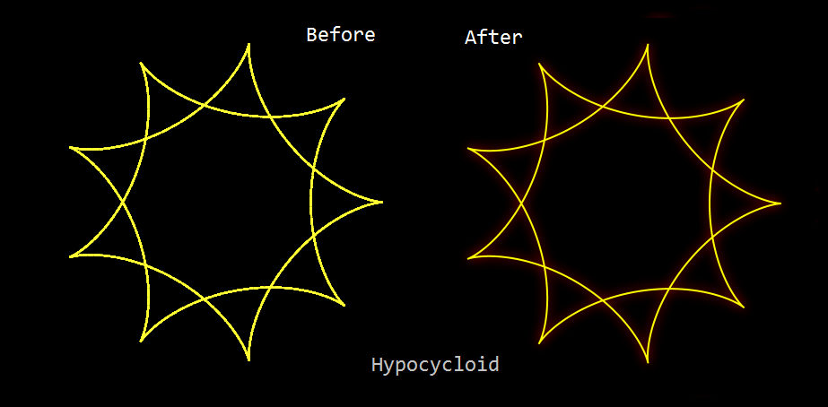
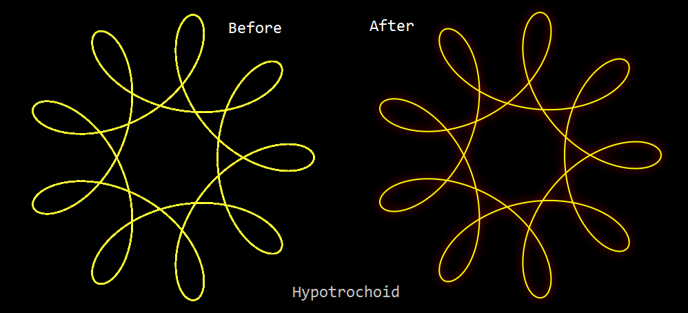

# RANGOLI
A random rangoli generator based on paper.js

## Table of Contents
1. [About](#about)
2. [Screenshots](#screenshots)
3. [Performance](#performance)
4. [Live demo](#live-demo)
5. [References](#references)

### About
Fusion of mathamatics and computer science. This is an attempt to visualize the results of Spirograph concepts at runtime with various runtime values. This generates beautiful drawings which can be used as a background images for various purposes.

### Screenshots (for Hypotrochoid)

  
  

### Performance
I have to say, Paper.js really lived up to the expectations. See the images for yourself. The before and after effects are stunning. And on top of it, these were achieved with just 1500 co-ordinates (infact 500 was enough) rather than the 7500 cells that were needed with the built-in JS version. Glad I have used this. Looking forward to make another implementation with is same.

  
  

### Live demo
https://satyapavan.github.io/rangoli/

## References
- This is roughly based on https://codepen.io/potatoDie/pen/LHBbx
